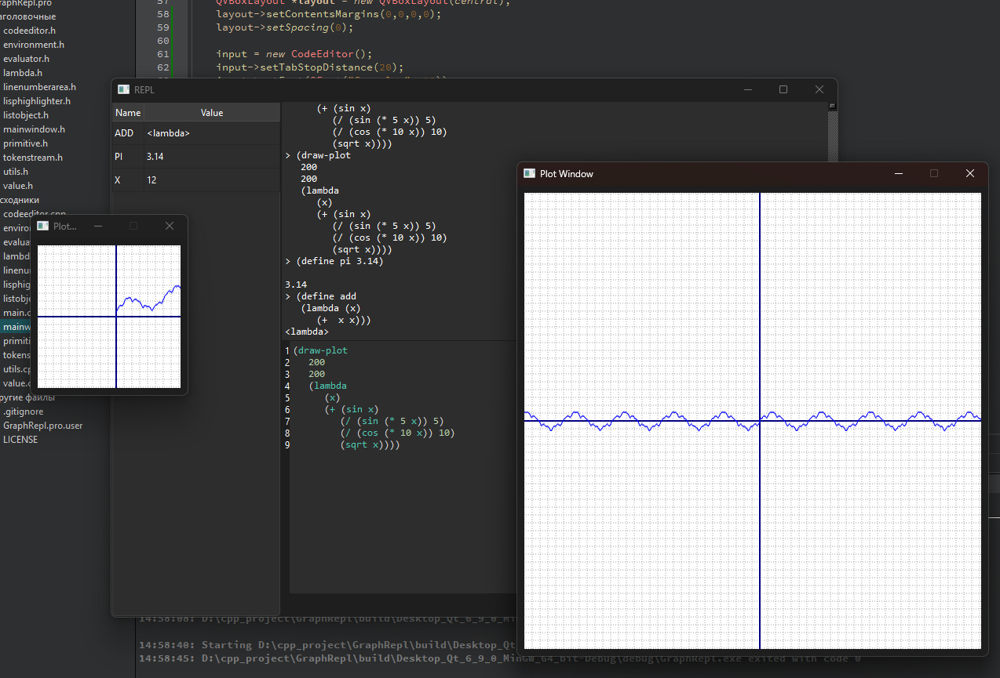

# GraphRepl

**GraphRepl** — це програма з діалектом **Lisp** для створення математичних графіків функцій.  
Діалект **Lisp**, що використовується тут, є модифікацією **MiniLisp**.

## Скриншот

## Встановлення

Перейдіть у розділ **Releases** на **GitHub** і завантажте інсталятор,  
або зберіть програму з вихідного коду.

## Автор

**Matvii Jarosh** matviijarosh@gmail.com

## Ліцензія

**MIT License**
